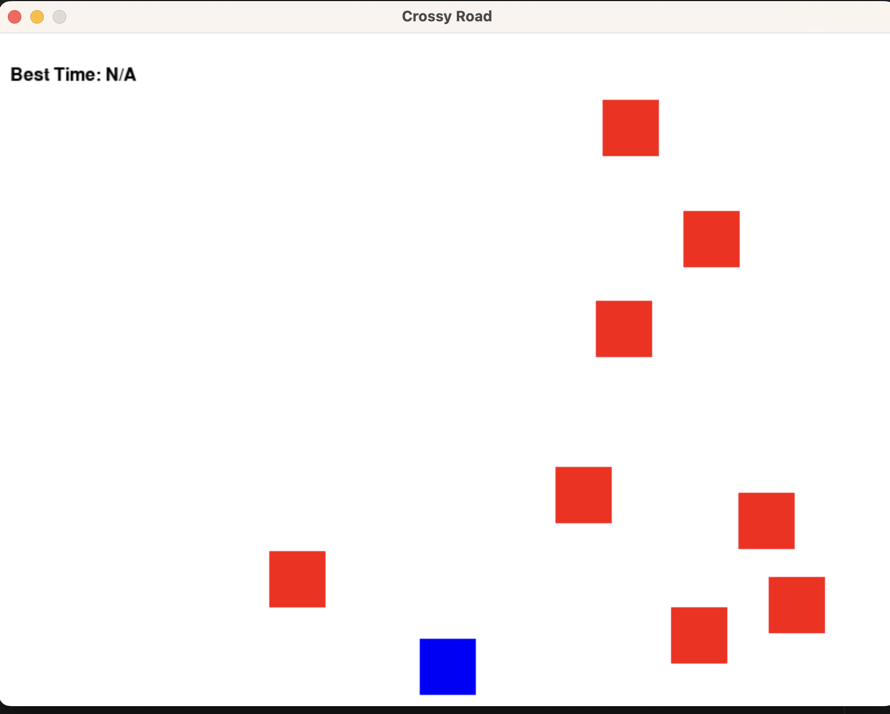

# Cuff Final Project
## CS110 Final Project  Spring 2024

## Team Members 

Patrick Cuff 
***

## Project Description

My project is meant to resemble the game "Crossy Road" to an extent. The player is meant to move vertically up the screen as enemies move horizontally across the screen. If you bump into an enemy, the game is over. The goal is to reach the end of the level(top of the screen) as fast as possible without dying, and the fastest time is the high score recorded. If you collide with an enemy, it is game over and you have the option of playing again. If you win, your best time is recorded and you have the option to play again to get the best score possible!
***    

## GUI Design

### Initial Design

### Final Design

## Program Design

### Features

1. start button on main screen that starts the game 
2.  player moves left, right, up, down by means of arrow key 
3.  player dies and ends game as they collide with moving enemy
4. player wins when they reach the top of the screen, win page appears
5. game over screen appears once you collide with enemy, and the play again option is available setting you back to the starting position
6.  win screen displays the high score, or "best time" in which the player has finished the game. This time can also be found in the top left of the screen as you play.
### Classes

- << You should have a list of each of your classes with a description-- will add once finished >>

## ATP

Test Case 1: Player Movement

a. Test Description: Verify that the player moves left, right, up, and down as expected
b. Test Steps:
1. Press the start game button
2. Press the arrow keys (up, down, left, right) to verify the player moves in their respective direction.
c. Expected Outcome: The player should move in the corresponding direction according to the arrow key inputs.

Test Case 2: Collision Detection with Enemy

a. Test Description: Ensure that collisions between the player and enemies are detected correctly.
b. Test Steps:
1. press the start game button
2. Use the arrow keys to move the player towards an enemy.
3. Verify that when the player collides with an enemy, the game over screen appears.
c. Expected Outcome: When the player collides with an enemy, the game over screen should appear.

**Test Case 3: Start Button/Main Menu Works

a. Test Description: Test the functionality of the start button or main menu.
b. Test Steps:
1. Launch the game.
2. Click on the start button located on the main menu
3. Verify that the game starts once you press the button.
c. Expected Outcome: Clicking on the start button should start the game.

**Test Case 4: Player wins

a. Test Description: Confirm that once the player reaches the end of the level, they win and are taken to the win screen.
b. Test Steps:
1. press the start game button
2. Move the player upward using the up key without hitting any enemies
3. Touch the top of the screen with your player, reaching the maximum height
4. Verify that the game takes you to the winner page, listing your best time.
c. Expected Outcome: The player is taken to the win page after they reach the maximum height of the level.

**Test Case 5:  Play Again

a. Test Description: Confirm that the play again button appears when the player collides with an enemy on the game over screen, and also appears when the player wins on the win screen.
b. Test Steps:
1. press the start game button
2. use the arrow keys to move the player into an enemy
3. verify that the play again button is offered and restarts the game for the player
4. use the arrow keys to avoid enemies and reach the end of the level at the top
5. verify that the play again button is offered on the win screeen and restarts the game for the player.
Click on the play again button.
c. Expected Outcome: The play again button should restart the game and allow the player to play again, offered when they die and when they win. 