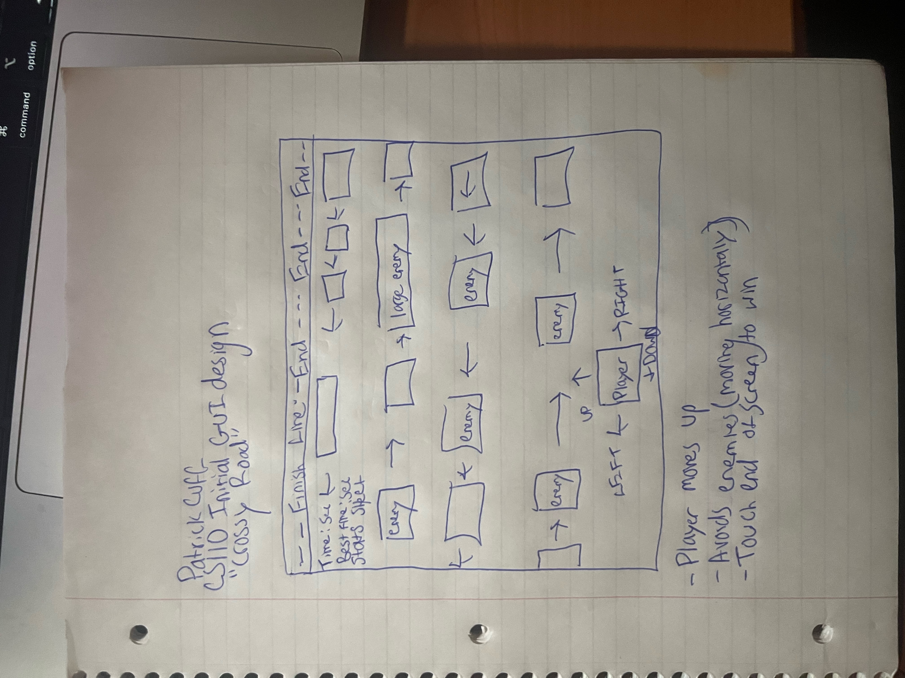

:warning: Everything between << >> needs to be replaced (remove << >> after replacing)

# Cuff Final Project
## CS110 Final Project  Spring 2024

## Team Members 

Patrick Cuff 
***

## Project Description

<>My project is meant to resemble the game "Crossy Road", in that the player is meant to move vertically up the screen as enemies move horizontally across the screen. If you bump into an enemy, the game is over and your score is added up by how far you get.  
***    

## GUI Design

### Initial Design

### Final Design

## Program Design

### Features

1. << start button on main screen that starts the game >>
2. << player moves left, right, up, down by means of arrow key >>
3. << player dies and ends game as they collide with moving enemy >>
4. << players score is tallied as they move up in the level >>
5. << game over screen appears once you collide with enemy, and the play again option is available setting you back to the starting position >>

### Classes

- << You should have a list of each of your classes with a description-- will add once finished >>

## ATP

| Step                 |Procedure             |Expected Results                   |
|----------------------|:--------------------:|----------------------------------:|
|  1                   | Press the start button  |Game should   |
|  2                   | click count button   | display changes to count = 1      |
etc...
**Test Case 1: Player Movement

Test Procedure:
a. Test Description: Verify that the player moves correctly in response to user input.
b. Test Steps:
Start the game.
Press the arrow keys (up, down, left, right) to move the player.
c. Expected Outcome: The player should move in the corresponding direction according to the arrow key inputs.

**Test Case 2: Collision Detection with Enemy

Test Procedure:
a. Test Description: Ensure that collisions between the player and enemies are detected correctly.
b. Test Steps:
Start the game.
Move the player towards an enemy.
Verify that when the player collides with an enemy, the game over screen appears.
c. Expected Outcome: When the player collides with an enemy, the game over screen should appear.

**Test Case 3: Start Button/Main Menu Works

Test Procedure:
a. Test Description: Test the functionality of the start button or main menu.
b. Test Steps:
Launch the game.
Click on the start button or navigate to the main menu.
Verify that the game starts or main menu options are accessible.
c. Expected Outcome: Clicking on the start button should initiate the game, and navigating to the main menu should display the menu options.

**Test Case 4: Score Tally as You Move Up

Test Procedure:
a. Test Description: Confirm that the score increases as the player moves up.
b. Test Steps:
Start the game.
Move the player up.
Verify that the score increases by 1.
c. Expected Outcome: The score should increase by 1 each time the player moves up successfully.

**Test Case 5: Game Over Screen Including Play Again Button

Test Procedure:
a. Test Description: Ensure that the game over screen appears with the play again button, and that clicking on it starts the game over.
b. Test Steps:
Play the game until the player loses.
Verify that the game over screen is displayed.
Click on the play again button.
c. Expected Outcome: The game over screen should be displayed with the play again button, and clicking on it should reset the player back to the starting postition
